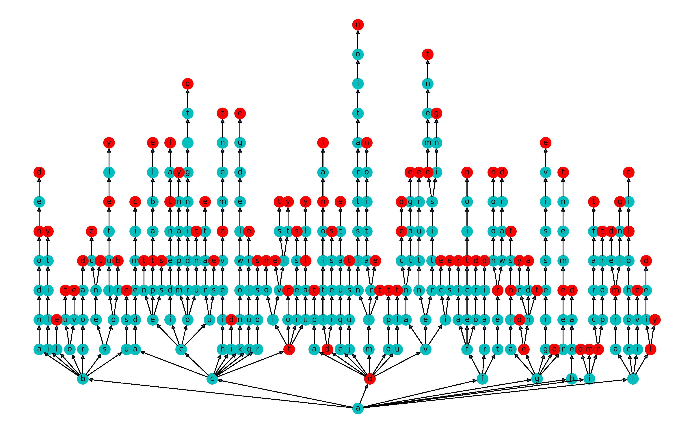

## Dictionary Graph
 
### Design

This module can be used to draw a dictionary as a tree graph. 
The graph layout is computed using [Buchheim algorithm](https://link.springer.com/content/pdf/10.1007/3-540-36151-0_32.pdf).
Based on the computed layout, this module provides a few layout directions to start with, 
including _top-bottom_, _bottom-top_, _left-right_, _right-left_, and _radial_.

#### Top to bottom layout


#### Bottom to top layout


#### Left to right layout


#### Right to left layout


#### Radial layout


### Usage
There are two ways to draw dictionary graphs. 

#### CLI
One is to use it in CLI following the below steps.
```sh
$ pip install -e .
$ draw_dict --infile assets/example_words.txt --rankdir=TB --outfile top_bottom.png --dpi 300 --figsize 16 10
$ draw_dict --infile assets/example_words.txt --rankdir=BT --outfile bottom_top.png --dpi 300 --figsize 16 10
$ draw_dict --infile assets/example_words.txt --rankdir=LR --outfile left_right.png --dpi 300 --figsize 10 16
$ draw_dict --infile assets/example_words.txt --rankdir=RL --outfile right_left.png --dpi 300 --figsize 10 16
$ draw_dict --infile assets/example_words.txt --rankdir=RADIAL --outfile radial.png --dpi 300 --figsize 16 16
```

#### As a Python module
Alternatively, you can use it as a py module. See `main.py` or the below code for an example. 
This function provides finer control over the graph such as node size, color, etc.

```python
# main.py
from dict_graph import draw_dictionary_graph

if __name__ == "__main__":
    with open("assets/example_words.txt") as fp:
        words = fp.read().splitlines()

    draw_dictionary_graph(words)
```